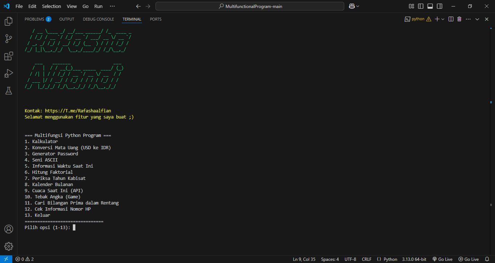

# 📱🔢 Multifunctional Python Tool

 

🚀 **Multifunctional Python Tool** adalah program multifungsi berbasis Python yang memiliki berbagai fitur menarik seperti kalkulator, konversi mata uang, generator password, seni ASCII, informasi waktu, faktorial, pengecekan tahun kabisat, kalender bulanan, cuaca saat ini, game tebak angka, pencarian bilangan prima, serta pengecekan informasi nomor HP secara detail! 🔥

## 🖥️ Demo




## ✨ Fitur Utama
- 🧮 **Kalkulator**: Lakukan operasi matematika dengan mudah.
- 💱 **Konversi Mata Uang**: Ubah USD ke IDR secara cepat.
- 🔐 **Generator Password**: Buat password yang aman dan unik.
- 🎨 **Seni ASCII**: Buat teks keren dalam berbagai gaya.
- ⏳ **Informasi Waktu Saat Ini**: Lihat tanggal dan waktu terkini.
- 🏆 **Hitung Faktorial**: Hitung faktorial dari angka yang diberikan.
- 📅 **Periksa Tahun Kabisat**: Ketahui apakah suatu tahun adalah kabisat.
- 🗓️ **Kalender Bulanan**: Tampilkan kalender untuk bulan tertentu.
- 🌤️ **Cuaca Saat Ini**: Dapatkan informasi cuaca dari berbagai kota.
- 🎲 **Game Tebak Angka**: Uji keberuntungan Anda dalam permainan seru ini.
- 🔢 **Cari Bilangan Prima**: Temukan bilangan prima dalam rentang tertentu.
- 📱 **Cek Informasi Nomor HP**: Periksa detail nomor HP dengan validasi API.

## 🛠 Instalasi

1️⃣ **Clone repository ini**
```bash
git clone https://github.com/Rfshacodeid/multifunctional-python-tool.git
cd multifunctional-python-tool
```

2️⃣ **Install dependencies**
```bash
pip install -r requirements.txt
```

3️⃣ **Jalankan program**
```bash
python main.py
```

## 🔧 Konfigurasi API
Untuk menggunakan fitur **cek informasi nomor HP**, daftarkan API key di [numverify.com](https://numverify.com), lalu masukkan API key Anda di dalam kode:
```python
api_key = "YOUR_API_KEY_HERE"
```

## 🤝 Kontribusi
Jika Anda ingin berkontribusi, silakan fork repository ini dan buat pull request. Kami akan senang menerima masukan dan fitur baru! 😃

## 📜 Lisensi
Proyek ini dilisensikan di bawah **MIT License**.

---
💡 **Dibuat oleh**: Rafasha Alfiandi
📩 **Kontak**: [Telegram](https://T.me/Rafashaalfian)

⭐ Jangan lupa beri bintang jika Anda menyukai proyek ini! ⭐

